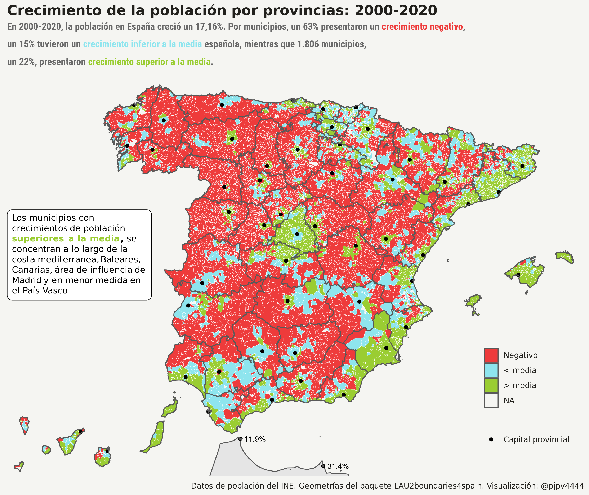

```{r setup, include=FALSE}
library(formatR)
knitr::opts_chunk$set(
  #code_folding = FALSE,
  echo = FALSE, warning = FALSE, message = FALSE,
  comment = "#>", results = "hold",
  collapse = TRUE,  fig.show = "hold", fig.asp = 0.618, fig.width = 6, out.width = "70%", fig.align = "center",
  R.options = list(width = 70) #- Keeping R code and output at 70 characters wide (or less) is recommended for readability on a variety of devices and screen sizes.
)
```

```{r options_setup, include = FALSE}
options(scipen = 999) #- para quitar la notación científica
```

```{r xaringanExtra-clipboard, include = FALSE}
htmltools::tagList(
  xaringanExtra::use_clipboard(
    button_text = "<i class=\"fa fa-clipboard\"></i>",
    success_text = "<i class=\"fa fa-check\" style=\"color: #90BE6D\"></i>",
  ),
  rmarkdown::html_dependency_font_awesome()
)
```

Siempre me ha gustado saber cuantos habitantes tiene mi pueblo y resulta que el 30 de diciembre de 2020 el INE publicó finalmente las cifras definitivas de [población municipal](https://www.ine.es/dyngs/INEbase/es/operacion.htm?c=Estadistica_C&cid=1254736177011&menu=resultados&idp=1254734710990) referentes a fecha 1 de enero de 2020, así que ...

## Introducción

Como señala el INE, la operación estadística "Cifras oficiales de población de los municipios españoles: Revisión del Padrón Municipal" publica con referencia a 1 de enero de cada año, la población por sexo a nivel municipal. ^[Las series comienzan en el año 1996, punto de arranque del actual sistema de gestión padronal y cuyas cifras van referidas al 1 de mayo siendo la Revisión a 1 de enero de 1998 la primera actualización en llevarse a cabo de acuerdo a este sistema.]

El **Padrón Municipal** es un registro administrativo donde constan los vecinos del municipio. Su formación, mantenimiento, revisión y custodia corresponde a los respectivos **ayuntamientos**, quienes **deben remitir al INE** las variaciones mensuales. El INE, realiza comprobaciones, subsana errores y duplicidades y obtiene para cada municipio la cifra de población. El Presidente del INE, con el informe favorable del Consejo de Empadronamiento, eleva al Gobierno la propuesta de cifras oficiales de población de los municipios españoles referidas a 1 de enero de cada año, para su aprobación mediante real decreto, **declarando así como oficiales las cifras de población** resultantes de la revisión del Padrón municipal y procediendo a su publicación en el Boletín Oficial del Estado.

De forma que la cifra oficial de **población en España a 1 de enero de 2020 fue de 47.450.795 personas**; es decir, 424.587 más que en 2019. Pero, ¿cómo está distribuida esa población por los 8.131 municipios españoles?

## Datos

El INE ofrece [aquí](https://www.ine.es/dynt3/inebase/es/index.htm?padre=517&capsel=525)^[El enlace de descarga es [este](https://www.ine.es/pob_xls/pobmun.zip)] los datos de población a nivel municipal. Los datos están en un archivo comprimido que contiene un fichero para cada año desde 1996, con la excepción de 1997, con la población de los municipios españoles (por genero) a 1 de enero de cada año.^[El fichero de 1996 tiene las cifras de población referenciadas a 1 de mayo]

Vamos al lio, hay que descargar, arreglar/limpiar y fusionar los distintos ficheros. El objetivo es tener los datos de todos los años en un único fichero. Esto yo ya lo había hecho hace tiempo, así que solo me ha tocado añadir los datos de 2020 y arreglar un poco el código. 

La verdad es que, al menos para mi, no es fácil fusionar los 24 ficheros de población municipal que ofrece el INE. Hay algunas inconsistencias en los nombres de los ficheros y variables que no siempre es fácil detectar, pero bueno ya lo tengo hecho.^[La verdad es que cuando estás arreglando un dataset y ves fallos tontos o inconsistencias que te van dificultando el proceso, maldices y juras como 100 veces en arameo, pero ninguna crítica al INE. Entiendo que intentan hacer las cosas lo mejor que pueden con sus restricciones de tiempo, personal etc ... y que tienen sus propios objetivos y su propia historia: en 1998, fecha de cuando datan algunos de los archivos, no se tenían ni los mismos conocimientos, ni herramientas, ni forma de trabajar etc... etc.... Además, cualquiera que vea mi código puede pensar lo mismo de mi, que no soy consistente etc ... pues sí, lo hago como sé y puedo con el tiempo que le quiero dedicar.], ^[De verdad, ninguna crítica al INE, pero quizás sí que el INE debería crear, igual ya existe, algún canal para hacer sugerencias para favorecer la usabilidad de los datos. Para un usuario medio creo que no es fácil fusionar estos datos ni detectar las inconsistencias para fusionarlos, así que mi petición al INE consistiría en que ofreciese, además de los ficheros tal y como están ahora, no tocarlos por favor, un enlace para descargar los ficheros ya fusionados]


Como nadie va a mirar mi código para ver cuales son esas inconsistencias a la hora de fusionar los ficheros, señalaré algunas:

- los nombres de los ficheros no incorporan el año completo, por ejemplo: `pobmun03.xls`

- hay ficheros `.xls` y `.xlsx`.

Estas dos inconsistencias son menores y la segunda de ellas es lógico que ocurra, dado que hay datos de cuando el formato `.xlsx` no existía^[El formato `.xlsx` apareció en 2007, pero el fichero INE con los datos de 1996 sí está en ese formato; sin embargo los de 1998 hasta 2013 están en formato `.xls`], pero dificultan el fusionar los ficheros de forma automática con código.

- generalmente los ficheros tienen una linea informativa antes de los datos, pero el fichero correspondiente a 1998 no tenía esa linea, y los ficheros de 2012 a 2015 y 2017 tenían dos lineas de cabecera.

- los ficheros de 2002, 2007 y 2009 tienen filas con los totales provinciales, cosa que no ocurre en el resto de años; ademas, el fichero de 2016 tiene una fila para el total de la población española.

Otra vez inconsistencias menores, que son totalmente lógicas, pero que dificultan la fusión de los archivos.

- en el fichero de 1998, el valor de la variable `CMUN` tiene cuatro dígitos, cuando debería tener solo 3. Hay que quedarse con los 3 primeros dígitos, creo que el cuarto es el primer dígito de la variable DC, dígito de control. Se debió colar.

Todas son inconsistencias menores y un error tonto, pero dificultan mucho la fusión de los ficheros anuales con la población municipal en un único fichero. Vuelvo a reiterar que son errores menores: a ver cuantos fallos he cometido yo!!! espero que ninguno, pero recordad que yo lo hago a veces por gusto, a veces por motivos profesionales. En este caso realicé la fusión para tener un fichero de datos con los que trabajar en clase.

###  ¿No hay otra forma de obtener los datos oficiales de población?

Sí, que yo sepa hay dos formas más:

- Los [microdatos](https://www.ine.es/dyngs/INEbase/es/operacion.htm?c=Estadistica_C&cid=1254736177012&menu=resultados&secc=1254736195462&idp=1254734710990#!tabs-1254736195462) del Padrón  Continuo. El INE provee un fichero .zip por año. Dentro del fichero .zip están los microdatos en varios formatos, incluyendo también un script para transformar los datos a formato R. Evidentemente los microdatos ofrecen más información: lugar de nacimiento y edad , pero por motivos de secreto estadístico se blanquea el municipio de residencia y nacimiento en los municipios de menos de 10.000 habitantes. Es decir, con los microdatos no podría saber cuantos habitantes tiene mi pueblo. 


- Un conjunto de tablas en formato `pcaxis` con la población municipal por genero y alguna otra característica (edad y lugar de nacimiento desagregado y cruzado a varios niveles). Con estas tablas podría ver por ejemplo la composición por edad o nacionalidad de mi pueblo. El INE ofrece estas tablas en un fichero para el periodo 2015-2020 y un fichero individual para años anteriores. Seguro que lo haré!!


## Análisis

La verdad es que al fichero con la población municipal fusionada ya le he sacado provecho en clase. Es un fichero que suele gustar a los estudiantes: a todos nos gusta contar y saber los habitantes de nuestro pueblo, sobre todo al [Conde Draco](https://www.youtube.com/watch?v=KZmLI7eYjmw).

Solo con los datos de población municipal no se pueden hacer, evidentemente, análisis complejos pero si sirven para ver algunas pautas en la población y su distribución territorial y también para contestar a muchas curiosidades como por ejemplo: ¿en qué provincias ha crecido más la población en la última década? o ¿cuantos municipios hay en España con más mujeres que hombres? Estos dos ejercicios solemos hacerlos en clase, así que aquí los replicaré en próximos posts.

Para cerrar este post presento un gráfico con las pautas, durante el periodo 2000-2020, del crecimiento de población en los municipios españoles. Como puede verse, buena parte del territorio experimenta reducciones de población. Los municipios que crecen por encima de la media española se concentran a lo largo de la costa mediterranea, en Baleares y Canarias, alrededores de Madrid y en menor medida el País Vasco. Asimismo, la mayoría de capitales provinciales o sus zonas limítrofes presentan crecimiento de población importantes. Por contra, como es bien sabido, las zonas del interior y alejadas de las capitales experimentan crecimientos negativos: [la España vaciada](https://www.geografiainfinita.com/2019/03/un-recorrido-por-la-espana-olvidada-y-vaciada/).


```{r, eval = FALSE, layout="l-page", code_folding = TRUE, echo = TRUE}
#- quiero hacer un mapa con el crecimiento de la población en el periodo 2000-2020
library(tidyverse)
library(sf)

# datos ----
geo_muni <- readr::read_rds("/home/pjpv/Escritorio/my_datos_2021/datos/geo_datos_mios/geo_muni_2020_LAU2_canarias.rds")
geo_prov <- readr::read_rds("/home/pjpv/Escritorio/my_datos_2021/datos/geo_datos_mios/geo_prov_2020_LAU2_canarias.rds")
pob_2000_2020 <- readr::read_rds("/home/pjpv/Escritorio/my_datos_2021/datos/INE/pob_mun/ine_pob_mun_1996_2020.rds")
geo_morocco <- rnaturalearth::ne_countries(scale = "medium", returnclass = "sf") %>% 
               dplyr::filter(sovereignt %in% c("Morocco")) %>% select(sovereignt)

#- crecimiento de la poblacon en España 2000-2020
crec_esp <- pob_2000_2020 %>% 
  filter(year %in% c(2000, 2020)) %>% 
  filter(poblacion == "Total") %>% 
  select(year, values) %>% 
  group_by(year) %>% 
  summarise(habitantes = sum(values)) %>% 
  mutate(crec_abs = habitantes - lag(habitantes)) %>% 
  mutate(crec_percent = crec_abs /lag(habitantes)) %>% ungroup()
media_crec_esp <-  crec_esp[[2,4]]*100
#- calculo crecimiento 2000-20 -----
pob_muni <- pob_2000_2020 %>% 
  filter(year %in% c(2000, 2020)) %>% 
  filter(poblacion == "Total") %>% 
  group_by(ine_muni, ine_muni.n, year) %>% 
  mutate(habitantes = sum(values)) %>% 
  select(ine_muni, ine_muni.n, capital_prov, ine_prov, ine_prov.n, ine_ccaa, ine_ccaa.n, year, habitantes) %>%
  distinct() %>% 
  pivot_wider(names_from = c("year"), values_from = c("habitantes")) %>% 
  mutate(crec_2020_2000 = `2020`- `2000`) %>% 
  mutate(crec_porcentual = (`2020`- `2000`) / `2000` *100) %>% 
  arrange(desc(crec_porcentual)) %>% ungroup() %>% 
  mutate(crec_porcentual.n = paste0(round(crec_porcentual, digits = 1), "%")) %>% 
  mutate(crec_porcentual_d = as_factor(case_when(
    crec_porcentual < 0 ~ "Negativo",
    between(crec_porcentual, 0, media_crec_esp) ~ "< media",
    crec_porcentual > media_crec_esp ~ "> media")))
pob_muni <- pob_muni %>% mutate(crec_porcentual_d = fct_relevel(crec_porcentual_d, "Negativo", "< media"))

#- theme -----------------
my_theme_maps <- theme_minimal() + theme(
  text = element_text(family = "Ubuntu Regular", color = "#22211d"),
  axis.line = element_blank(),
  axis.text.x = element_blank(),
  axis.text.y = element_blank(),
  axis.ticks = element_blank(),
  axis.title.x = element_blank(),
  axis.title.y = element_blank(),
  # panel.grid.minor = element_line(color = "#ebebe5", size = 0.2),
  panel.grid.major = element_line(color = NA, size = 0.2), #- "#ebebe5"
  panel.grid.minor = element_blank(),
  plot.background = element_rect(fill = "#f5f5f2", color = NA), 
  panel.background = element_rect(fill = "#f5f5f2", color = NA), 
  legend.background = element_rect(fill = "#f5f5f2", color = NA),
  panel.border = element_blank(),
  strip.text.x = element_blank(),
  strip.background = element_rect(colour="white", fill="white"),
  legend.position = c(.9,.2),
  plot.title = element_text(size = 16, face = "bold")  )

#- decido q geometrías uso ----
my_geo <- geo_muni #- AQUI-AQUI
my_geo <- inner_join(my_geo, pob_muni)  #- AQUI-AQUI
my_canarias <- my_geo %>% 
  filter(ine_ccaa == "05") #- solo para el cuadrito, no para las geo
ceuta <- my_geo %>% filter(ine_ccaa %in% c(18,19))
capitales <- pob_muni %>% 
  filter(capital_prov == "Sí") %>% 
  left_join(. , st_drop_geometry(geo_muni)) %>% 
  mutate(capital_prov.2 = ifelse(capital_prov == "Sí", "Capital provincial", "NO"))

#- elección de variables q grafíco ----
my_vv <- expr(crec_porcentual_d)  #- AQUI-AQUI   (para la leyenda)
my_vv_2 <- expr(crec_porcentual.n)  #- AQUI-AQUI  para el label text

#janitor::tabyl(pob_muni, crec_porcentual_d)

#- Plot con labels
p <- ggplot() + 
  geom_sf(data = geo_morocco, aes(geometry = geometry)) +
  geom_sf(data = my_geo, aes(geometry = geometry, fill = !!my_vv), color = NA ) + 
  geom_point(data = capitales, aes(x = X, y = Y, color = capital_prov.2)) +
  geom_text(data = ceuta, aes(x = X1, y = Y1, label = !!my_vv_2), #- v. continua
            color = "black",  
            check_overlap = TRUE, size = 3) + #- fontface = "bold"
  geom_sf(data = geo_prov, aes(geometry = geometry, fill = NA )) + 
  coord_sf(xlim = c(st_bbox(my_geo)[1]-0.2, st_bbox(my_geo)[3]+0.3), 
           ylim = c(st_bbox(my_geo)[2]-0.1, st_bbox(my_geo)[4]+0.3), expand = FALSE) + 
  geom_rect(aes(xmin = st_bbox(my_canarias)[1]-2.5, xmax = st_bbox(my_canarias)[3]+0.1, 
                ymin = st_bbox(my_canarias)[2]-2.5, ymax = st_bbox(my_canarias)[4]+0.1), 
            fill = NA, colour = "black", size = 0.3, show.legend = FALSE, linejoin= "round", linetype = 2) +
  scale_color_manual(name = NULL,  values = c("black")) +
  scale_fill_manual(name = NULL,  values = c("#ee3b3b", "#8ee5ee",  "#9acd32")) +
  labs(title = "Crecimiento de la población municipal: 2000-2020",
       subtitle = my_subtitle, x = "", y = "",
       caption = "Datos de población del INE. Geometrías del paquete LAU2boundaries4spain. Visualización: @pjpv4444") 
```


```{r, echo = FALSE, layout="l-page"}

```
