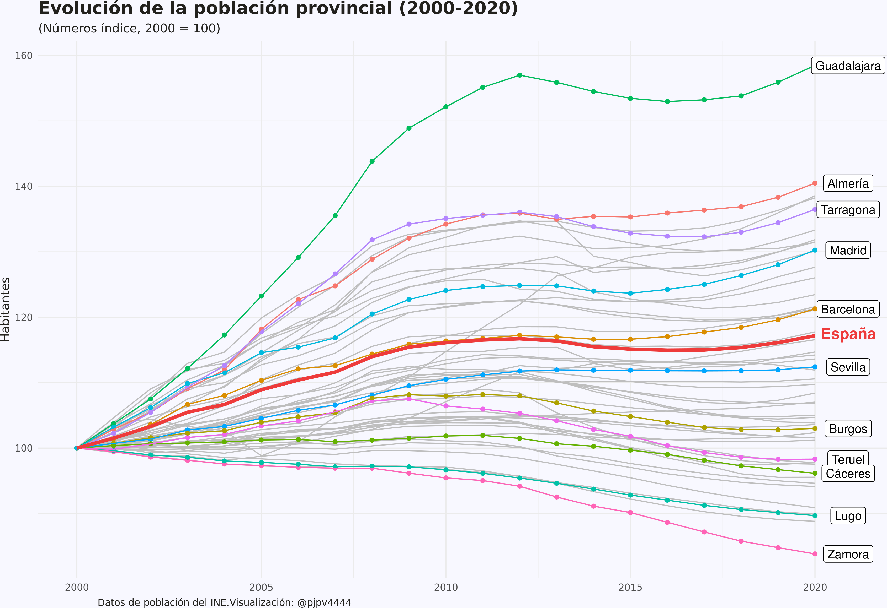

```{r setup, include=FALSE}
library(formatR)
knitr::opts_chunk$set(
  #code_folding = FALSE,
  echo = FALSE, warning = FALSE, message = FALSE,
  comment = "#>", results = "hold",
  collapse = TRUE,  fig.show = "hold", fig.asp = 0.618, fig.width = 6, out.width = "70%", fig.align = "center",
  R.options = list(width = 70) #- Keeping R code and output at 70 characters wide (or less) is recommended for readability on a variety of devices and screen sizes.
)
```

```{r options_setup, include = FALSE}
options(scipen = 999) #- para quitar la notación científica
```

```{r xaringanExtra-clipboard, include = FALSE}
htmltools::tagList(
  xaringanExtra::use_clipboard(
    button_text = "<i class=\"fa fa-clipboard\"></i>",
    success_text = "<i class=\"fa fa-check\" style=\"color: #90BE6D\"></i>",
  ),
  rmarkdown::html_dependency_font_awesome()
)
```

## Intro

En el [segundo post](https://perezp44.github.io/pjperez.web/posts/2021-02-10-poblacion-municipal/) realicé una visualización, un mapa, una coropleta, con el crecimiento de la población municipal para el periodo 2000-2020. En este post voy a repetir el análisis pero para la población provincial. En realidad sólo tengo cambiar unas pocas lineas de mi anterior análisis, pero a veces las cosas no son tan sencillas y te acabas liando. Al final he hecho **3 visualizaciones**.

## Datos

Los datos ya los tenía arreglados. Lo hice en el segundo post. Ahora sólo hay que cambiar unas pocas lineas para obtener, en lugar de los municipales, los crecimientos de población por provincias.

```{r, eval = FALSE, echo = TRUE, code_folding = TRUE}
#- quiero hacer un mapa con el crecimiento de la población (por provincias) en el periodo 2000-2020
library(tidyverse)

#- datos de población
pob_2000_2020 <- readr::read_rds("/home/pjpv/Escritorio/my_datos_2021/datos/INE/pob_mun/ine_pob_mun_1996_2020.rds")

#- rtdos (crec. poblacion en España)
pob_esp <- pob_2000_2020 %>% 
  filter(year %in% c(2000, 2020)) %>% 
  select(year, poblacion, values) %>% 
  group_by(year, poblacion) %>% 
  summarise(habitantes = sum(values)) %>% 
  group_by(poblacion) %>% 
  mutate(crec_abs = habitantes - lag(habitantes)) %>% 
  mutate(crec_percent = crec_abs /lag(habitantes)) %>% ungroup()

#- resultados pob provincial
pob_prov <- pob_2000_2020 %>% 
  filter(year %in% c(2000, 2020)) %>% 
  filter(poblacion == "Total") %>% 
  group_by(ine_prov, ine_prov.n, year) %>% 
  mutate(habitantes = sum(values)) %>% #- hago mutate y no summarise xq quiero guardar CCAA
  select(ine_prov, ine_prov.n, ine_ccaa, ine_ccaa.n, year, habitantes) %>%
  distinct() %>% 
  pivot_wider(names_from = c("year"), values_from = c("habitantes")) %>% 
  mutate(crec_2020_2000 = `2020`- `2000`) %>% 
  mutate(crec_porcentual = (`2020`- `2000`) / `2000` *100) %>% 
  arrange(desc(crec_porcentual)) %>% ungroup() %>% 
  mutate(crec_porcentual.n = paste0(round(crec_porcentual, digits = 1), "%")) %>% 
  mutate(crec_porcentual_d = 
           cut(crec_porcentual, 
               breaks=c(-Inf, 0.0, 10, pob_esp$crec_percent[6]*100, 30, Inf), 
               labels=c("Negativo","[ 0% - 10%)","[10% - media)", "[media, 30%)", " >30%")))
```

## Mapa: coropleta

Después cargar las geometrías, fusionar con los datos de crecimiento de población y hacer el mapa. Me costó un poquito el otro día para el segundo post, hoy easy-peasy.

```{r, eval = FALSE, echo = TRUE, code_folding = TRUE}
library(sf)
# datos geo originales de LAU2 (pero con Canarias shifted) ----
geo_prov <- readr::read_rds("/home/pjpv/Escritorio/my_datos_2021/datos/geo_datos_mios/geo_prov_2020_LAU2_canarias.rds")
# Morocco geometría
geo_morocco <- rnaturalearth::ne_countries(scale = "medium", returnclass = "sf") %>% 
  dplyr::filter(sovereignt %in% c("Morocco")) %>% select(sovereignt)
#- fusionar geometria y crec.
my_geo <- left_join(my_geo, pob_prov) 
```


```{r, echo = FALSE, layout="l-page"}
knitr::include_graphics("./imagenes/map_crec_pob_provincial.png")
```


<br>

El gráfico corrobora las tendencias mostradas en el [segundo post](https://perezp44.github.io/pjperez.web/posts/2021-02-10-poblacion-municipal/): las provincias que crecen por encima de la media española se concentran a lo largo de la costa mediterránea, en Baleares y Canarias, Navarra, la Rioja, así como en Madrid y su área de influencia. Por contra, el interior de Galicia (Lugo y Orense) y las provincias más occidentales de Castilla y León presentan los decrecimientos de población provinciales más intensos.

Por supuesto, estos resultados solo nos ofrecen alguna pista parcial sobre la dinámica de la población. Son una foto fija de todo el periodo. Por ejemplo, Zamora es la provincia con una mayor descenso, un 16,2%, pero ¿ha sido este descenso un fenómeno sostenido en el tiempo o es algo reciente? 

La verdad es que la mejor opción para visualizar los datos sería hacer un [shiny](https://shiny.rstudio.com/), y que las personas interesadas tuviesen la libertad de analizar los datos que les interesasen, pero, de momento, lo dejo estar. Ya haré algún shiny más adelante, cuando consiga tunear uno a mi gusto para que sea medio nice-looking. De momento, aquí, voy a explorar otros 2 tipos de visualizaciones: [spaghetti plots](https://www.data-to-viz.com/caveat/spaghetti.html) y [heatmaps.](https://www.r-graph-gallery.com/heatmap).

## Spaghetti plot 

Para ver la evolución en el tiempo de una variable, como es nuestro caso, lo más adecuado es una gráfica de linea temporal, pero es que son 52 provincias, así que, a no ser que utilicemos facets u otra técnica, nos va a salir lo que se suele conocer como un spaghetti plot. Vamos a verlo.

Los datos ya están medio procesados pero, para evitar el problema de las escalas, voy a utilizar números índices en la visualización.

```{r, echo = FALSE, layout="l-body-outset", code_folding = FALSE}

```

Dos conclusiones. Primera, sí, mejor un shiny y así puedes seleccionar exactamente lo que quieres visualizar. Ya lo haré. Segunda: que hacer un buen gráfico es muy costoso. Nunca se acaba, ni lo dejas como te gustaría!!

Como veis no comento nada de la evolución de las series. Es que ya dije que los posts los escribo para mi y principalmente para aprender a programar en R. El objetivo era hacer el gráfico, no analizar  que pasó con la población a nivel provincial.

## Heatmap

Nunca había hecho un heatmap, así que ya tocaba hacer uno. Hacer heatmaps con `ggplot2` es sencillo, solo hay que usar `geom_tile()` y prácticamente sale sólo, como por arte de magia; además, hay, como mínimo, 2 paquetes específicos para heatmaps: [`tidyheatmaps`](https://jbengler.github.io/tidyheatmaps/articles/tidyheatmap.html) y [`superheat`](https://rlbarter.github.io/superheat/index.html). Para aprender, utilicé  [este post](https://www.royfrancis.com/a-guide-to-elegant-tiled-heatmaps-in-r-2019/) y [este bookdown](https://rkabacoff.github.io/datavis/Other.html#heatmaps).

Probé diversas cosas y al final me quedo con 2. La verdad es que es complicado hacer un "buen" heatmap. Yo lo he intentado y el resultado ha quedado un poco meh!, y eso que me he apoyado bastante en la [vignette de `tidyheatmaps`](https://jbengler.github.io/tidyheatmaps/articles/tidyheatmap.html) y en [este post](https://www.royfrancis.com/a-guide-to-elegant-tiled-heatmaps-in-r-2019/).

El primero está hecho con el paquete `tidyheatmaps`. Es muy fácil hacer el heatmap,la vignette está muy bien explicada. El inconveniente es que al final no es un ggplot, por lo que no es fácil tunearlo a tu gusto fuera de las opciones que ha implementado el desarrollad@r. Como se ve, en el gráfico hay mucha información resulta, en cierta manera, complicado sacar conclusiones sin utilizar información adicional

<br>

```{r, echo = FALSE, layout="l-page", code_folding = FALSE}
knitr::include_graphics("./imagenes/heatmap_01.png")
```

<br>

El segundo está hecho con `geom_tile()` por lo que se pueden usar todas las opciones de configuración de ggplot2. El resultado visual es muy diferente porque en este gráfico no he mostrado tanta información: sólo he mostrado una variable dicotómica. En concreto se muestra, para cada año, si el crecimiento de la población en cada provincia fue superior al del conjunto de España o por contra fue menor.

Se aprecia que, hay provincias, como Murcia o Illes Balears, que en general han crecido durante todo el periodo por encima de lo que lo ha hecho la población española y otras provincias, como Palencia, León o Burgos, que siempre lo han hecho por debajo del agregado español.

No soy especialista en el tema ni demógrafo pero se aprecia, principalmente en el spaghetti plot, que, evidentemente hay dinámicas propias en las diferentes provincias españolas, con un grupo de provincias que presentan perdidas de población continuadas desde al menos 2000, pero que seguramente comenzasen en la década de los 60, y otro grupo de provincias más dinámicas y que presentan ganancias continuadas de población. Sin embargo, como no podría ser de otra forma, la dinámica de la población provincial también responde a patrones comunes a la economía española como se aprecia en el hecho de que la crisis de 2010, fruto de la crisis financiera de 2008, acabo teniendo un efecto importante en la dinámica de la población a través de sus efectos en la inmigración, llegando incluso a materializarse en un retorno de inmigrantes a sus países de origen, lo que dado las bajas tasas de natalidad en España, se tradujo en reducciones de población a nivel agregado, así como en la mayoría de provincias, incluidas las más dinámicas.

<br>


```{r, echo = FALSE, layout="l-page", code_folding = FALSE}
knitr::include_graphics("./imagenes/heatmap_02.png")
```

<br>

Bueno!!! Me reafirmo, conforme aprendo más sobre `ggplot2` más me gusta hacer gráficos pero ... es bastante complicado dejarlos bien acabados y desde luego lleva tiempo, así que ya vale, creo que los próximos posts aprovecharé mi plantilla para hacer coropletas que esa sí la he dejado bastante niquelada.


