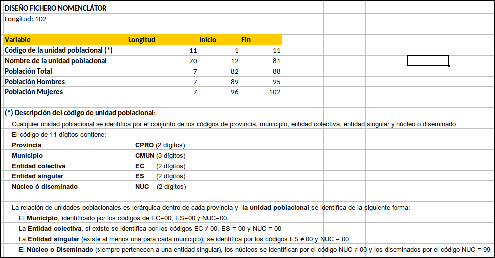
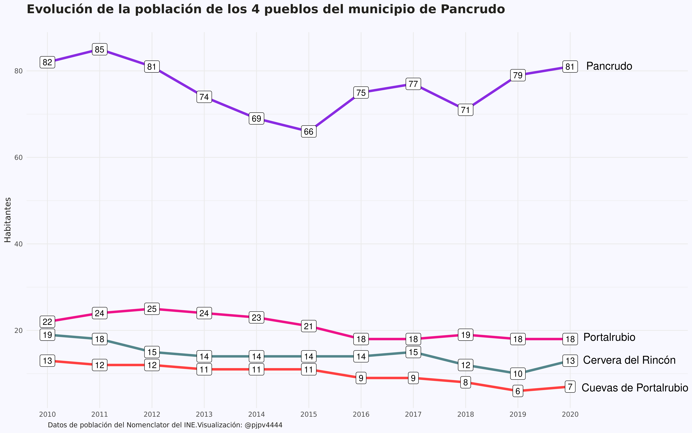

```{r setup, include=FALSE}
library(formatR)
knitr::opts_chunk$set(
  #code_folding = FALSE,
  echo = FALSE, warning = FALSE, message = FALSE,
  comment = "#>", results = "hold",
  collapse = TRUE,  fig.show = "hold", fig.asp = 0.618, fig.width = 6, out.width = "70%", fig.align = "center",
  R.options = list(width = 70) #- Keeping R code and output at 70 characters wide (or less) is recommended for readability on a variety of devices and screen sizes.
)
```

```{r options_setup, include = FALSE}
options(scipen = 999) #- para quitar la notación científica
```

```{r xaringanExtra-clipboard, include = FALSE}
htmltools::tagList(
  xaringanExtra::use_clipboard(
    button_text = "<i class=\"fa fa-clipboard\"></i>",
    success_text = "<i class=\"fa fa-check\" style=\"color: #90BE6D\"></i>",
  ),
  rmarkdown::html_dependency_font_awesome()
)
```

## Nomenclator del INE

En este post voy a hablar de otra operación estadística del INE: el Nomenclator. ¿Que por qué me interesa el Nomenclator? Pues porque quiero saber cuantos habitantes tiene mi pueblo. Mi pueblo es [Pancrudo](https://es.wikipedia.org/wiki/Pancrudo), pero en realidad la palabra pueblo, que mucha gente emplea para referirse a una localidad con pocos habitantes, es según la [Wikipedia](https://es.wikipedia.org/wiki/Pueblo), un término ambiguo. 

El INE no ofrece datos ni para pueblos ni para localidades, el INE ofrece datos de población para [municipios](https://es.wikipedia.org/wiki/Municipio). Perfecto, porque en el post anterior arreglaste los datos de población para municipios. Es verdad, pero a pesar de que sí que existe el municipio de Pancrudo, mi pueblo, no es un municipio. Trato de explicarlo.

Existe el municipio de [Pancrudo](https://es.wikipedia.org/wiki/Pancrudo), sí, pero está compuesto de 4 localidades o pueblos: [Cervera del Rincón](https://es.wikipedia.org/wiki/Cervera_del_Rinc%C3%B3n), [Cuevas de Portalrubio](https://es.wikipedia.org/wiki/Cuevas_de_Portalrubio), [Portalrubio](https://es.wikipedia.org/wiki/Portalrubio) y Pancrudo. Es decir, mi pueblo (Pancrudo) es una de las 4 localidades o pueblos del municipio también llamado Pancrudo. Un poco de lío!!

Por lo tanto, si quiero saber cuantos habitantes tiene mi pueblo no me vale con los datos que utilicé en el post anterior, tengo que ir al Nomenclator del INE. Como podemos leer [aquí](https://www.ine.es/dyngs/INEbase/es/operacion.htm?c=Estadistica_C&cid=1254736177010&menu=resultados&idp=1254734710990), El Nomenclátor^[O Población del Padrón Continuo por unidad poblacional] contiene la relación detallada de las entidades y núcleos de población existentes a 1 de enero en cada municipio, así como su población. Perfecto, parece que en el Nomenclator sí que aparecerá la población de mi pueblo. En realidad el Nomenclator no utiliza el término pueblo sino que para el Nomenclator mi pueblo será una entidad o núcleo de población. Bueno eso me da igual, vamos a por los datos.


La verdad es que me complico las cosas, con lo fácil que es buscar en El INE los habitantes de un **municipio** en los diferentes censos. Por ejemplo, [aquí](https://www.ine.es/intercensal/intercensal.do?search=1&error1=Debe+introducir+un+nombre+de+municipio.&error2=Debe+introducir+al+menos+3+caracteres.&cmbTipoBusq=0&textoMunicipio=Pancrudo&btnBuscarDenom=Consultar+selecci%C3%B3n) está la búsqueda para el **municipio** de Pancrudo. En las notas al pie de la tabla nos dice que en el censo de 1970 el municipio de Pancrudo ya incorpora a Cervera y Cuevas, y que en el censo de 1981 se incorpora Portalrubio. Viendo los datos de la tabla se aprecia que, al menos para Pancrudo, el fenómeno de la progresiva despoblación de la España rural parece empezar en los 60. Los demógrafos dirán!!

### Los datos 

Los datos del Nomenclator están [aquí](https://www.ine.es/nomen2/ficheros.do). El INE ofrece un fichero .zip para cada año desde 2010 a 2020. Dentro del .zip hay 2 ficheros^[Un fichero .txt y otro .xlsx] con la misma información: el código, el nombre y la población total y por genero de cada entidad o núcleo de población.


En el diseño de registro del Nomenclator puede verse que el código de las entidades tiene 11 dígitos: los 2 primeros se corresponden con el código provincial y los 3 siguientes con el código del municipio; es decir, los 5 primeros dígitos identifican a que municipio pertenece cada entidad.


```{r, echo = FALSE, layout="l-body-outset"}

```


Se aprecia que, además de [municipios](https://es.wikipedia.org/wiki/Municipio), en el Nomenclator hay [entidades colectivas](https://es.wikipedia.org/wiki/Entidad_colectiva_de_poblaci%C3%B3n), [entidades singulares](https://es.wikipedia.org/wiki/Entidad_singular_de_poblaci%C3%B3n), [nucleos](https://es.wikipedia.org/wiki/N%C3%BAcleo_de_poblaci%C3%B3n) y [diseminados](https://es.wikipedia.org/wiki/Diseminado). Como veis no es que sea fácil-fácil entender los pormenores de estas categorías. Como ejemplo, claro y diáfano al menos para mi: mi pueblo, Pancrudo, es una entidad singular y un núcleo que pertenece al municipio de Pancrudo. Portalrubio, otro pueblo, es otra entidad singular y núcleo del municipio de Pancrudo. Lo mismo ocurre para Cervera del Rincón y Cuevas de Portalrubio. En el municipio de Pancrudo no hay entidades colectivas ni diseminados.


La verdad es que el procesado de los 11 ficheros me costó un poquito: menos mal que medio me gusta y me "relaja".^[Yo creo que me gusta y relaja porque es un reto, pero es un reto que sé que voy a superar y que hay una solución "correcta". No es como un gráfico que siempre se puede mejorar. Una vez has procesado los datos ya está, no hay más que hacer, es un problema que tiene una "solución cerrada". Además durante el proceso tienes a alguien, el INE, con el que cabrearte por no haber pensado más en que sus datos sean más fácilmente reutilizables. Todo ventajas!!]


### Habitantes de mi pueblo

Ahora que he procesado los datos del Nomenclator, ya puedo hacer un gráfico con la evolución de los habitantes de mi pueblo y ya que me pongo la hago de los cuatro pueblos del municipio de Pancrudo.

```{r, eval = FALSE, echo = TRUE, code_folding = TRUE}
library(tidyverse)
nomenclator <- readr::read_csv("/home/pjpv/Escritorio/my_datos_2021/datos/INE/nomenclator/ine_nomenclator_2010_2020.csv")

pancrudo <- nomenclator %>% filter(ine_muni.n == "Pancrudo") %>% 
  filter(tipo == "Entidad singular") %>% 
  filter(poblacion == "Total") %>% 
  mutate(year1 = as.character(year)) %>% 
  mutate(name = as_factor(case_when(
    name == "PANCRUDO" ~ "Pancrudo",
    name %in% c("CERVERA DEL RINCON", "CERVERA DEL RINCÓN") ~ "Cervera del Rincón",
    name == "PORTALRUBIO" ~ "Portalrubio",
    name == "CUEVAS DE PORTALRUBIO" ~ "Cuevas de Portalrubio"))) %>% 
  mutate(name = fct_relevel(name, c("Pancrudo", "Portalrubio", "Cervera del Rincón", "Cuevas de Portalrubio")))

pancrudo_2020 <- pancrudo %>% filter(year == 2020) %>% select(year, year1, name, values)

p <- ggplot() + 
  #geom_point(data = pancrudo, aes(x = year1, y = values, color = name)) +
  geom_line(data = pancrudo, aes(x = year1, y = values, color = name, group = name), size = 1.5) +
  geom_label(data = pancrudo, aes(x = year1, y = values, label = values)) +
  #geom_text(data = pancrudo_2020, aes( x = year1, y = values,label = name), nudge_x = 1, check_overlap = TRUE, hjust = 0.5) +
  scale_color_manual(name = NULL,  values = c("blueviolet", "deeppink2", "cadetblue4", "brown1")) +
  labs(title = "Evolución de la población de los 4 pueblos del municipio de Pancrudo",
       subtitle = "",
       x = NULL,
       y = "Habitantes",
       caption = "Datos de población del Nomenclator del INE.Visualización: @pjpv4444", 
       color = NULL) +
  theme(plot.title = element_text(size = 16, face = "bold"),
        legend.position = "none") +
  annotate(geom = "text", x = 11.75, y = 81.2, label ="Pancrudo", color = "black", size = 5) +
  annotate(geom = "text", x = 11.75, y = 18.5, label ="Portalrubio", color = "black", size = 5) +
  annotate(geom = "text", x = 12.135, y = 13.2, label ="Cervera del Rincón", color = "black", size = 5) +
  annotate(geom = "text", x = 12.24, y = 6.8, label ="Cuevas de Portalrubio", color = "black", size = 5) +
  scale_x_discrete(expand = expansion(mult = c(0.04, .225))) +
  theme_minimal() + theme(plot.title = element_text(size = 16, face = "bold"),
    legend.position = "none",
    text = element_text(family = "Ubuntu Regular", color = "#22211d"),
    plot.background = element_rect(fill = "ghostwhite", color = NA),
    plot.caption = element_text(hjust = 0.05))
p
#- para guardar el plot
ggsave(p, filename = here::here("evolucion_poblacion_pancrudo.png"),
       device = "png", width = 32, height = 20, units = "cm")

```

```{r, echo = FALSE, layout="l-body-outset"}

```

Como veis Pancrudo es pequeñito, pero es la capital del municipio. En 2015 llegamos a un mínimo de 66 habitantes pero parece que recuperamos. Cuevas, Cervera y P️ortalrubio también intentan mantenerse. Ánimo!! 💪🏿⬆


### Algunas curiosidades

Ya que tengo los datos del Nomenclator operativos me ha entrado curiosidad por conocer algunas cosas y ver si por fin entendía lo que es una entidad colectiva, una entidad singular, un núcleo y un diseminado. Al final medio lo entendí usando los datos de Pancrudo. Pancrudo es un municipio compuesto por 4 entidades singulares, pero además esas 4 entidades singulares son núcleos, no son diseminados. Lo que no sé seguro es si una entidad singular puede tener un núcleo y además uno o varios diseminados, creo que sí, pero ya me cansé de los datos.

Curiosidades:

- ¿Qué municipio tiene más entidades colectivas, singulares, núcleos y diseminados?

```{r, eval = FALSE}
#- CURIOSIDADES ------------------------
#- municipios con mas entidades colectivas etc ...
df <- nomenclator %>% filter(poblacion == "Total") %>% filter(year == 2020)

zz_colectivas <- df %>% filter(tipo == "Entidad colectiva") %>% 
  group_by(ine_muni) %>% mutate(NN = n()) %>% 
  select(ine_muni, ine_muni.n, ine_prov.n, NN) %>% distinct()
zz_Lugo <- df %>% filter(ine_muni == 27028) %>% filter(tipo == "Entidad colectiva")

zz_singulares <- df %>% filter(tipo == "Entidad singular") %>% 
  group_by(ine_muni) %>% mutate(NN = n()) %>% 
  select(ine_muni, ine_muni.n, ine_prov.n, NN) %>% distinct()
zz_Mieres <- df %>% filter(ine_muni == 33037) %>% filter(tipo == "Entidad singular")
janitor::tabyl(zz_Mieres, values)

zz_nucleos <- df %>% filter(tipo == "Nucleo") %>% 
  group_by(ine_muni) %>% mutate(NN = n()) %>% 
  select(ine_muni, ine_muni.n, ine_prov.n, NN) %>% distinct()

zz_diseminados <- df %>% filter(tipo == "Diseminado") %>% 
  group_by(ine_muni) %>% mutate(NN = n()) %>% 
  select(ine_muni, ine_muni.n, ine_prov.n, NN) %>% distinct()
zz_Villalba <- df %>% filter(ine_muni == 27065)
```

Pues resulta que en 2020 el municipio con más [entidades colectivas](https://es.wikipedia.org/wiki/Entidad_colectiva_de_poblaci%C3%B3n) era Lugo con 54. En cuanto a entidades singulares gana Mieres, en Asturias, con 520, ^[No me lo puedo creer 520!!], y 140 de ellos con cero habitantes. Ahora si que no entiendo nada!! Núcleos: en núcleos, Vigo en cabeza con 292. Por último diseminados: Villaba, municipio de Lugo, con 446. Parece increíble, pero es real!!

- Quería ver si estos datos sirven para enlazar series de población de  municipios que han sufrido segregaciones. La respuesta es sí. Por ejemplo, en el año 2019, El Palmar de Troya se segregó del municipio de Utrera. Veámoslo en un gráfico:^[Iba a hacerlo pero ... shit happens y lo tengo que dejar, creo que ya vale con el Nomenclator!!! Sí.]

```{r, eval = FALSE}
#- EL Palmar de Troya
df <- nomenclator %>% filter(poblacion == "Total") 
my_codes <- c("41095000000", "41904000000", "41095000201")
zz <- df %>% filter(code %in% my_codes)
```


