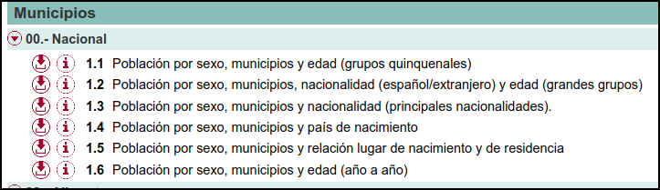

```{r setup, include=FALSE}
library(formatR)
knitr::opts_chunk$set(
  #code_folding = FALSE,
  echo = FALSE, warning = FALSE, message = FALSE,
  comment = "#>", results = "hold",
  collapse = TRUE,  fig.show = "hold", fig.asp = 0.618, fig.width = 6, out.width = "70%", fig.align = "center",
  R.options = list(width = 70) #- Keeping R code and output at 70 characters wide (or less) is recommended for readability on a variety of devices and screen sizes.
)
```

```{r options_setup, include = FALSE}
options(scipen = 999) #- para quitar la notación científica
```

```{r xaringanExtra-clipboard, include = FALSE}
htmltools::tagList(
  xaringanExtra::use_clipboard(
    button_text = "<i class=\"fa fa-clipboard\"></i>",
    success_text = "<i class=\"fa fa-check\" style=\"color: #90BE6D\"></i>",
  ),
  rmarkdown::html_dependency_font_awesome()
)
```

## Intro/motivación

Llevo unos días, desde que empece el blog, jugando y trasteando con datos del Padrón continuo, y todo indica que seguiré unos días más, quiero procesar 2/3 tablas más y así poder hacer análisis tan importantes como ver que municipios/provincias tienen más mujeres que hombres o ver que municipios/provincias son más "cerrados", en el sentido de que un mayor porcentaje de su población vive en el mismo municipio en el que nació. Seguramente también veré que municipios/regiones tienen una población más joven.


Parece un poco de obsesión por datos de población, igual tenía que haber sido demógrafo, pero es que en clase suelo utilizar este tipo de datos para enseñar R. Son datos sencillos de entender y una forma fácil de empezar con R, así que, ahora que tengo más o menos claro qué es y qué datos hay en el Padrón continuo, voy a documentarlo para poder usarlo el año que viene.

## Padrón continuo

En España, cada municipio tiene un registro conocido como el **Padrón municipal de habitantes** donde constan los vecinos del municipio. Cuando una persona se inscribe en el padrón de su municipio debe aportar obligatoriamente estos datos: nombre y apellidos, género, domicilio habitual, nacionalidad, lugar y fecha de nacimiento, DNI o similar para no nacionales. El Padrón es un registro importante ya que, por ejemplo, a partir de él se confeccionan los censos electorales y las cifras oficiales de población. 

Hasta el 1 de mayo de 1996, el padrón municipal de España se renovaba cada cinco años. Desde entonces se transforma en padrón continuo. Los ayuntamientos deben remitir mensualmente al INE los cambios en el registro de habitantes; es decir, el INE coordina los registros de todos los municipios. A partir de estos datos, el INE confecciona la **Estadística del Padrón continuo**.

Dentro de esta operación estadística el INE publica dos conjuntos de datos:

- Los [microdatos](https://www.ine.es/dyngs/INEbase/es/operacion.htm?c=Estadistica_C&cid=1254736177012&menu=resultados&secc=1254736195462&idp=1254734710990#!tabs-1254736195462) del Padrón Continuo. El INE provee un fichero .zip por año. Dentro del fichero .zip están los microdatos en varios formatos, incluyendo también un script para transformar los datos a formato R. Por motivos de secreto estadístico se blanquea el municipio de residencia y nacimiento en los municipios de menos de 10.000 habitantes. Es decir, con los microdatos no podría saber cuantos habitantes tiene mi pueblo, tuve que irme al Nomenclator, pero podría ver cosas como 쯖uantas personas nacidas en Madrid están viviendo actualmente en Teruel?

- Un [conjunto de tablas](https://www.ine.es/dyngs/INEbase/es/operacion.htm?c=Estadistica_C&cid=1254736177012&menu=resultados&secc=1254736195462&idp=1254734710990#!tabs-1254736195461) con distintos niveles de desagregación y horizontes temporales con parte de la información que aparecen en los microdatos.^[Más abajo hablo de las tablas que me interesan y que utilizaré en varios posts más.]


## Más estadísticas relacionadas con el Padrón

Además, partiendo de los datos del Padrón continuo, el INE ofrece una [serie de estadísticas](https://www.ine.es/dyngs/INEbase/es/categoria.htm?c=Estadistica_P&cid=1254734710984) como: 
  
  - Cifras oficiales de población de los municipios españoles^[Estos son los datos que he utilizado en el segundo y cuarto post, donde veía en que municipios y provincias había crecido más la población durante el periodo 2000-2020]   

- Nomenclátor^[Utilice estos datos en el tercer post cuando puede ver la evolución habitantes de mi pueblo]  
- Relación de municipios y sus códigos por provincias ^[Utilice estos datos en el primer post, cuando descubrimos que existía Aliaga del Lagarto. Lo siento Pili!!!  😇   🤣 🦎🦎 🤣]

- Estadística de variaciones residenciales^[Por si algún día quiero saber cuantas personas nacidas en Burgos residen actualmente en Teruel] 

- Estadística del Padrón de españoles residentes en el extranjero^[Seguro que le echo un vistazo cuando salgan los nuevos datos el 18 de marzo]

- Apellidos y nombres más frecuentes^[En uno de los trabajos que los estudiantes elaboraron este curso, utilizaron estos datos. El trabajo está [aquí](https://dasdfg098.github.io/trabajo_BigData_equipo/) y el repo [aquí](https://github.com/dasdfg098/trabajo_BigData_equipo)]


## Más detalles sobre las tablas del Padrón continuo

Bueno, volvamos a la [Estadística del Padrón continuo.](https://www.ine.es/dyngs/INEbase/es/operacion.htm?c=Estadistica_C&cid=1254736177012&menu=ultiDatos&idp=1254734710990). Ya he comentado que el INE ofrece un conjunto amplio de tablas con datos parciales del Padrón para distintos niveles de desagregación y horizontes temporales. Las tablas que más me interesan son las tablas con información  a nivel municipal, y censal. Para clase y el blog procesaré los datos con detalle municipal.

Hay seis tablas. Veámoslas:

```{r, echo = FALSE, , layout = "l-body-outset"}

```

El INE ofrece cada una de estas 6 tablas en un fichero para el periodo 2015-2020 y un fichero individual para años anteriores. 

De las 6 tablas, procesaré la tercera, la quinta y la  sexta. Con los datos de la quinta tabla veré que municipios/provincias son más cerradas, en el sentido de que un mayor porcentaje de su población vive en el mismo municipio en el que nació. Con los datos de la sexta tabla, seguramente también veré que municipios/regiones tienen una población más joven y/o más centenarios. Todo jugar. Con los datos de cualquiera de las tablas puedo replicar uno de los análisis que ya hicimos en clase: ver en que municipios/provincias hay más mujeres que hombres. Ya lo hicimos en clase el curso pasado y salía algún resultado curioso.

Para las secciones censales hay disponibles también seis tablas. Son muy parecidas a las que hay para los municipios, pero se centran más en la nacionalidad, además cada año tiene su propio fichero y sólo están disponibles en formato PC-Axis, mientras que las de municipios se pueden descargar en varios formatos.


```{r, echo = FALSE, layout = "l-body-outset"}
knitr::include_graphics("./imagenes/tablas_padron_secciones.png")
```


